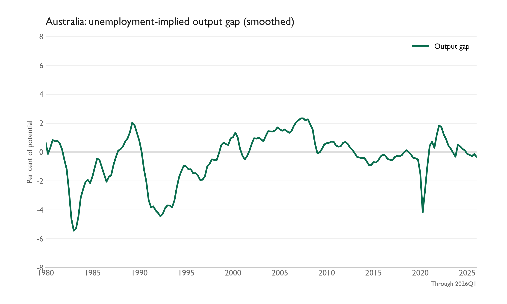
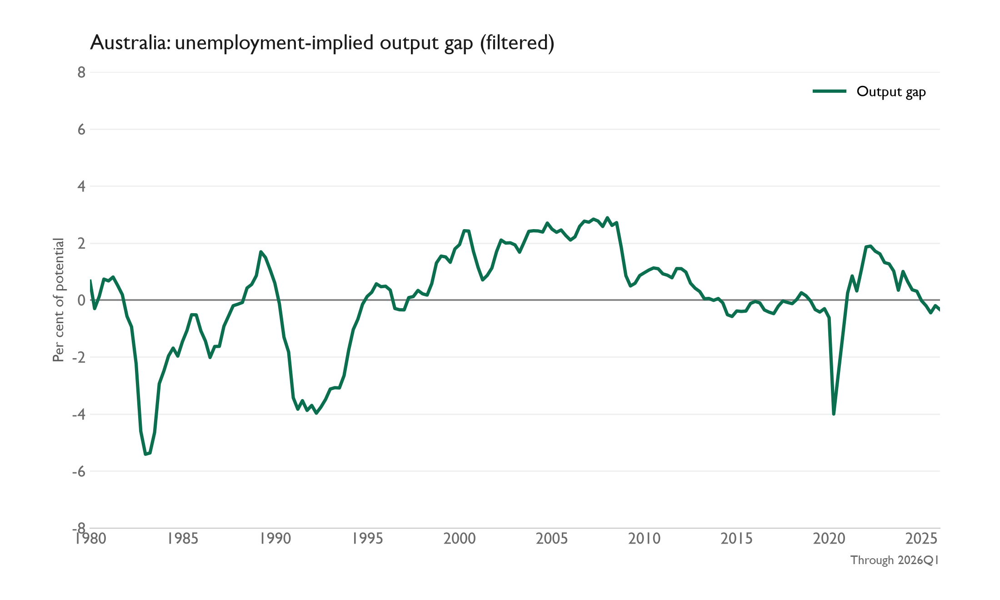
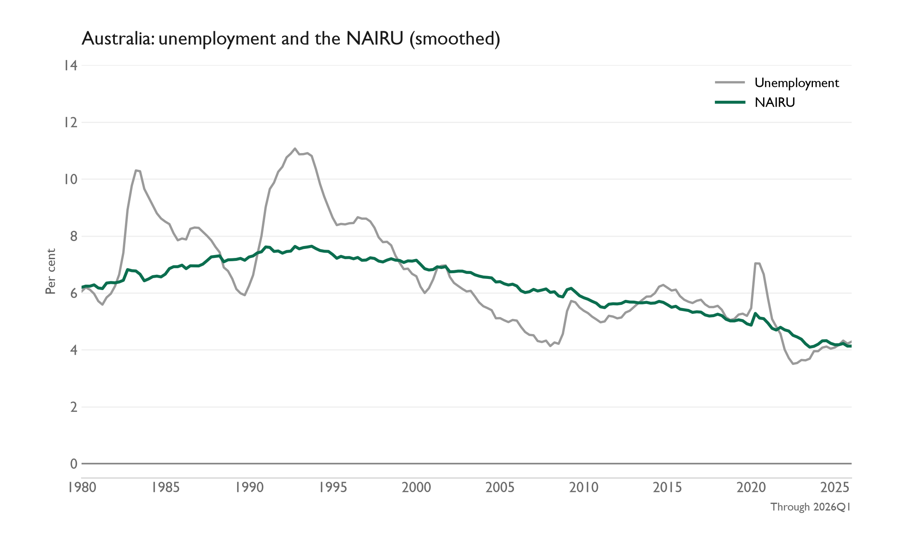
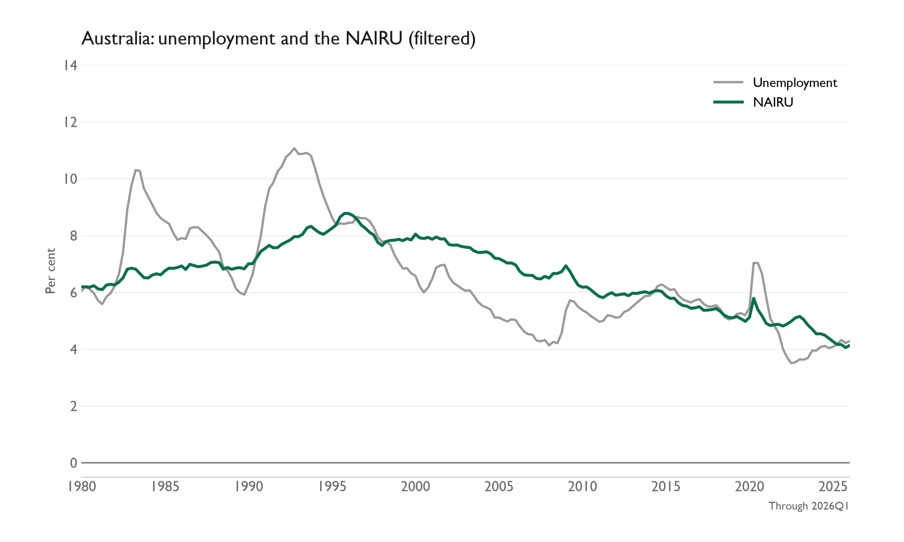

# AU SMOG Model

The Australian SMOG state-space model estimates the output gap, potential output, and the non-accelerating inflation rate of unemployment (NAIRU).

Its output-gap estimate is strongly informed by unemployment. It is one measure of spare capacity; a sound assessment of the output gap also needs other evidence and models.

This folder has three Python scripts:

1. [au_smog_model_generation.py](code/au_smog_model_generation.py) builds the historical 1980Q1–2023Q4 model from the `Generation` tab of the bundled workbook, applies the fitted coefficients in `output/au_ss1_output.csv`, and saves those coefficients plus the initial state to `au_smog_fitted_parameters.json`.
2. [au_smog_model_update.py](code/au_smog_model_update.py) extends the series when the `Update` tab gains new quarters. It keeps the saved coefficients and initial state fixed and reruns the Kalman filter and smoother.
3. [au_smog_figure_generation.py](code/au_smog_figure_generation.py) generates the six charts from the saved smoothed and filtered states. The update script calls it automatically; run it alone to refresh only the figures.

## Run

From the `AU Smog Model` folder:

```powershell
py -3.14 -m pip install -r requirements.txt
py -3.14 code/au_smog_model_generation.py
py -3.14 code/au_smog_model_update.py
# Optional: regenerate figures without updating model states
py -3.14 code/au_smog_figure_generation.py
```

Run the generation script once, or when deliberately changing the historical specification or reference coefficients. After adding a new quarter to the `Update` tab of `results/AU SMOG Model Inputs.xlsx`, run only the update script; it also refreshes the figures. Run the figure script separately if only the chart styling changes. Use `py -3.14 code/au_smog_model_update.py --check-only` to calculate without replacing the result CSV or charts.

The generation script writes `output/smog_au_smoothed_states.csv` for the historical sample. The update script writes smoothed states to `results/smog_au_python.csv` and filtered states to `results/smog_au_filtered_states.csv`. Both have columns `date`, `output_gap`, `y_star`, and `u_star`. It also refreshes the PNGs in [results/figures](results/figures/README.md). Both scripts read files from this folder; neither needs the original Stats Research directory.

## Figures

The charts follow the style used in `Macro Work/Interest Rates/charts`: the model estimate is dark green, observed unemployment is grey, series labels appear in the top-right legend, and a grey line marks zero. Smoothed states use the full available sample at each date; filtered states use observations available only through that date, with coefficients held fixed.









[Unemployment gap — smoothed](results/figures/au_smog_unemployment_gap_smoothed.png) · [Unemployment gap — filtered](results/figures/au_smog_unemployment_gap_filtered.png). The plotted gap is the model's NAIRU minus observed unemployment, in percentage points; negative values indicate labour-market slack.

## Data and model files

- [results/AU SMOG Model Inputs.xlsx](results/AU%20SMOG%20Model%20Inputs.xlsx), `Generation` tab: historical non-farm GDP, trimmed CPI, import prices, COVID, unit labour costs, and corrected unemployment. Generation uses rows only through 2023Q4. The six later rows retained for reference are highlighted red and excluded from generation and the update history.
- The same workbook, `Update` tab: the six series used for quarters after 2023Q4, plus the date. The update script reads new observations here; the figure script reads its unemployment series for the charts. Add new quarters to this tab.
- `output/au_ss1_output.csv`: the original fitted coefficient table used by the generation script.
- `au_smog_fitted_parameters.json`: the fixed coefficients and initial state passed from generation to update.

## Documentation

- [Assessing Potential Output and the Output Gap in Australia — selected pages](Assessing%20Potential%20Output%20and%20the%20Output%20Gap%20in%20Australia%20-%20selected%20pages.pdf) is an excerpt from the Reserve Bank of Australia's July 2024 *Bulletin* article by Bishop et al. It contains the introduction, the assessment and model discussion, and Appendix A's SMOG specification (original pages 1, 5–10, and 12–13).
- [SMOG AU model documentation](SMOG_AU_Model_Documentation.pdf) is retained alongside the article excerpt.

## Data notes

The old estimation workbook had a date-shifted unemployment column. The `Generation` tab contains corrected historical unemployment. Update combines its historical data with new quarters from the `Update` tab. The figures use estimated states and observed unemployment from `Update`. The update script preserves historical model inputs through 2023Q4 and appends the new quarters, so changes to newer input data do not silently re-estimate or replace the historical coefficients.

## Verification

The generated historical series has 176 quarters (1980Q1–2023Q4). The fixed-parameter update produced 185 quarters through 2026Q1. The saved parameter file was unchanged by the update. A separate fresh maximum-likelihood run did not converge, so this package uses the fitted coefficients from the bundled EViews output table rather than that run.

[Back to macro work](../README.md)
