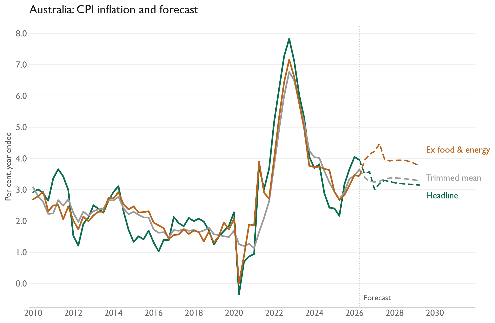

# Australia inflation forecast

[Core and underlying inflation histories](Australia%20-%20Core%20Inflation%20Measures.xlsx) provide ABS monthly analytical measures and long RBA quarterly histories. The shared construction pipeline and combined workbook are archived; this country workbook remains active. Existing forecast outputs below have not been rerun.

A quarterly VAR forecasts headline CPI, trimmed mean CPI, and CPI excluding food and energy for 12 quarters. The drivers are unemployment, inflation expectations, import prices, oil, and Stage 2 pipeline prices. Oil and Stage 2 monthly values are averaged into quarters. The workbook contains only the required columns from the original `AU` and `AU-M` sheets.

[Model code](au.py) · [Input workbook](Data%20Inputs.xlsx) · [Forecast CSV](results/au_inflation_forecast.csv)

[Results and methodology analysis](Analysis/README.md)

The last observed quarter in this data snapshot is 2026Q2; the saved forecast runs through 2029Q2. Run `py -3.14 run_all_var_models.py` from the `macro-work` folder to update results and charts from the bundled inputs. The [shared inflation guide](../../Documentation/INFLATION_MODELS.md) describes the method and dependencies.
