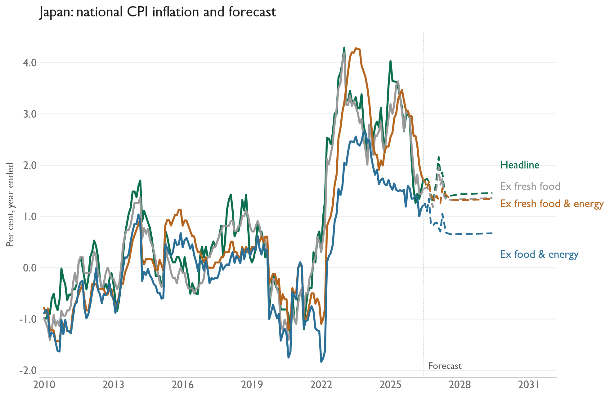
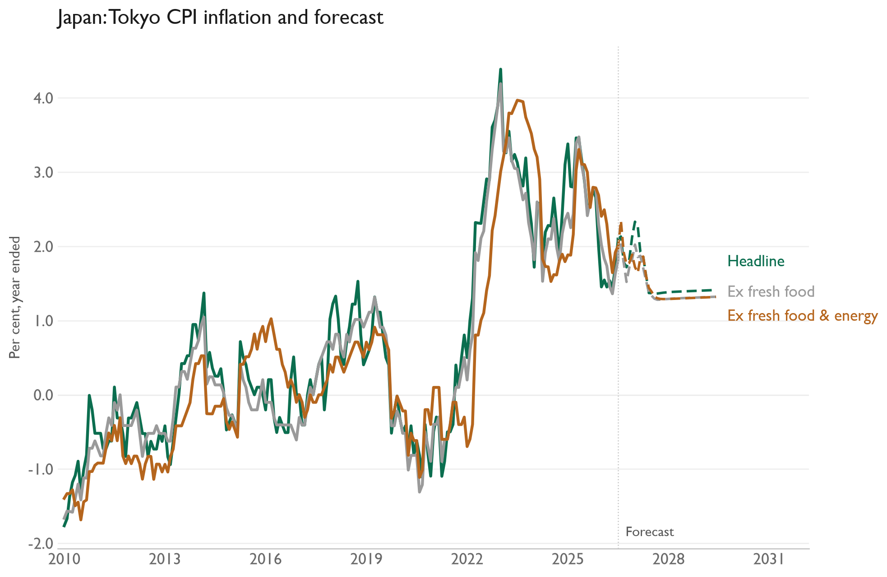

# JP Inflation Model

Japan inflation research, containing the original VAR forecast and the full national CPI history downloaded from e-Stat.

[Download all official CPI history and hierarchy tiers in Excel](Japan%20CPI%20-%20All%20Historical%20Data.xlsx). The master worksheet includes every downloaded monthly and annual table, with series down the rows and dates across columns. Five additional tier sheets each cover a complete basket whose weights sum to 1. The guide and official hierarchy sheets show the weight checks. Rebuild with `python japan_official/make_excel.py`.

- [Official CPI history and download instructions](japan_official/README.md): 751 item and aggregate series, published monthly and annual inflation rates, weights and coverage metadata.
- [CPI downloader](japan_official/download.py) and [series catalog](japan_official/metadata/series_catalog.csv).

The original forecast below still uses its bundled June 2026 workbook snapshot. The new official CPI files are available for further modelling and have not been substituted into the existing VAR inputs.

Monthly VARs forecast four national CPI measures and three Tokyo CPI measures for 36 months. Each includes unemployment, oil, import prices, and Stage 2 pipeline prices. The workbook contains only the required columns from the original `JN` sheet. All index variables enter as monthly percentage changes; unemployment enters as a level.

[Model code](jp.py) · [Input workbook](Data%20Inputs.xlsx) · [National CPI CSV](results/jp_cpi_inflation_forecast.csv) · [Tokyo CPI CSV](results/jp_tokyo_inflation_forecast.csv)

[Results and methodology analysis](Analysis/README.md)

The last observed month in this data snapshot is June 2026; the saved forecasts run through June 2029. Install `../../requirements.txt` and run `py -3.14 jp.py` in this folder to update Japan's forecast results. To update all three VAR countries and their charts, run `py -3.14 run_all_var_models.py` from the `macro-work` folder. The [shared inflation guide](../../Documentation/INFLATION_MODELS.md) describes the method and chart dependencies. CPI download dependencies are listed separately in `japan_official/requirements.txt`.

[Back to macro work](../../README.md)
