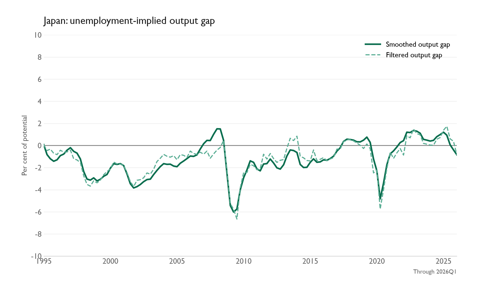
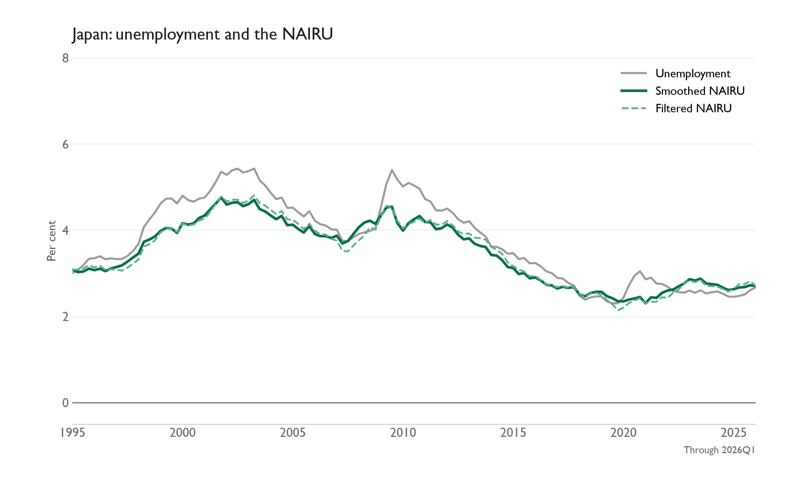

# JP SMOG Model

The Japanese SMOG state-space model estimates the output gap, potential output, and the non-accelerating inflation rate of unemployment (NAIRU).

Its output gap is strongly informed by unemployment. It is one measure of spare capacity; a good assessment also needs other evidence and models.

The scripts use the Australian model's standalone workflow, short `#` comments, `# %%` cell delimiters, bounded Python maximum-likelihood fit, saved coefficients, and convergence diagnostics. They preserve the existing Japanese specification: eight states, four observed signals, two unemployment-gap lags, Tankan inflation expectations, and a policy-regime change from 2013Q1. Japan has no separate COVID coefficient. Coefficients are estimated from the bundled Japanese inputs in Python.

## Run

From this folder, using Python 3.14:

```powershell
py -3.14 -m pip install -r requirements.txt
py -3.14 code/jp_smog_model_generation.py
py -3.14 code/jp_smog_model_update.py
# Optional: refresh only the state charts
py -3.14 code/jp_smog_figure_generation.py
```

1. [Generation](code/jp_smog_model_generation.py) fits 21 coefficients on 1995Q1–2022Q4, then saves the coefficients, initial state, historical smoothed states, and optimizer history. At the end, `plt.show()` displays all parameter paths and the log-likelihood convergence in the Python interactive window. These diagnostic figures are not saved as image files.
2. [Update](code/jp_smog_model_update.py) appends complete new quarters from the workbook's `Update` tab, keeps coefficients and initial state fixed, and reruns the Kalman filter and smoother. It writes both sets of states and refreshes the three state charts. Use `--check-only` to calculate without writing results or charts.
3. [Figure generation](code/jp_smog_figure_generation.py) refreshes the three saved state charts from the result CSVs without fitting the model again.

Use the generation script once, or deliberately rerun it to re-estimate the model. For new observations, append actual data to `Update` and run the update script. Keep the complete historical rows in both tabs: transformations require lagged inputs. Run each function or class definition as a whole; indented blocks are not independent executable cells.

## Model inputs

[JP SMOG Model Inputs.xlsx](code/JP%20SMOG%20Model%20Inputs.xlsx) contains copied values from the maintained `JN - Q` sheet in the original `Model Inputs.xlsx`. It has no external links or runtime dependency on that source workbook.

- `Generation`: raw observations from 1980Q1 through 2022Q4. The fit uses 1995Q1–2022Q4; earlier rows support transformations and HP starting values.
- `Update`: raw observations through 2026Q1, the source's latest actual-data quarter. No forecast rows were copied.
- `Notes`: source, field definitions, sample boundaries, and missing-data notes.

| Input | Model transformation |
| --- | --- |
| `real_gdp_sa` | Natural logarithm of seasonally adjusted real GDP |
| `cpi_core_sa` | Four-quarter percentage change in core CPI |
| `unemployment` | Unemployment rate, per cent |
| `expectations_tankan` | Maintained expectations series, used directly |
| `labour_sa` | Four-quarter percentage change in labour costs |
| `import_price_deflator` | Four-quarter level change in import prices |

The workbook preserves missing early observations. The model masks signals without the required lagged regressors. Historical expectations are copied as supplied; the source's Tankan-labelled series may include spliced earlier observations. Updating observations through 2022Q4 in `Update` does not replace the generation history used by the model.

## Results and figures

- [Fitted parameters](jp_smog_fitted_parameters.json): coefficients, initial state, estimation sample, convergence result, and imposed NAIRU noise floor.
- [Historical states](output/smog_jp_smoothed_states.csv): smoothed estimates over the original fit sample.
- [Fit history](output/jp_smog_fit_history.csv): starting point and every accepted optimizer iteration, all 21 coefficients, total likelihood, and likelihood gain.
- [Quarterly likelihood contributions](output/jp_smog_fit_likelihood_by_quarter.csv): each quarter's likelihood contribution at each recorded iteration.
- [Updated smoothed states](results/smog_jp_python.csv) and [filtered states](results/smog_jp_filtered_states.csv): 125 quarters from 1995Q1 through 2026Q1.





[Unemployment gap](results/figures/jp_smog_unemployment_gap.png) is NAIRU minus observed unemployment, in percentage points. Negative values indicate slack. All three charts combine smoothed and filtered estimates, use zero lines and upper-right legends, and stop at the latest complete observation. See the [figure notes](results/figures/README.md).

Smoothed states use the complete observation sample. Filtered states use observations only through each quarter, conditional on coefficients and HP-based initialization estimated from the historical sample. They are not a vintage-data real-time backtest.

## Fit and verification

The Python fit converged in 441 iterations on 112 quarters, with log likelihood 25.718260. The NAIRU innovation standard deviation is 0.112964, above the data-derived floor of 0.072897 (half the sample standard deviation of quarterly unemployment changes). The unemployment observation-noise standard deviation reaches its lower bound of 0.00001. These bounds are modelling choices; convergence does not establish a global optimum or strong identification.

The labour-cost equation preserves Japan's unusual positive unemployment-gap loading constrained between 8 and 9. The fitted loading is close to 9. This inherited restriction should be considered when interpreting the results; it was not replaced by Australia's equation.

Verification compared the copied data transformations, initial states, every state-space matrix, missing-signal masks, and likelihood against the existing Japanese specification using the same data-based trial coefficients. The update was also checked in an isolated copy of this folder, with no access required to the original research files. The saved coefficients remain unchanged during updates.

[Model equations and fitted coefficients](MODEL_NOTES.md)

[Back to macro work](../../README.md)
