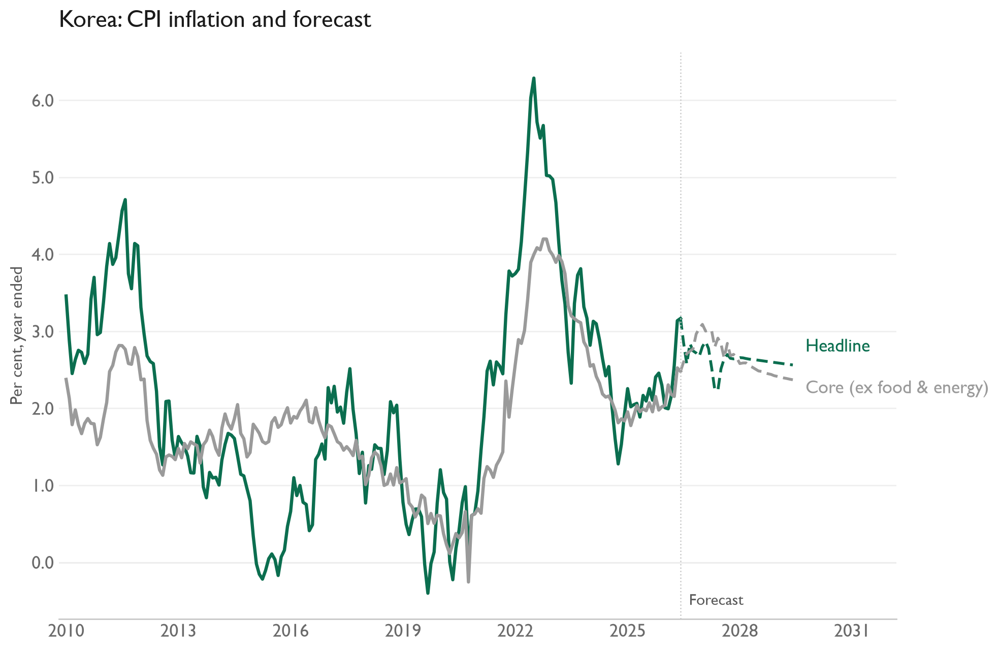
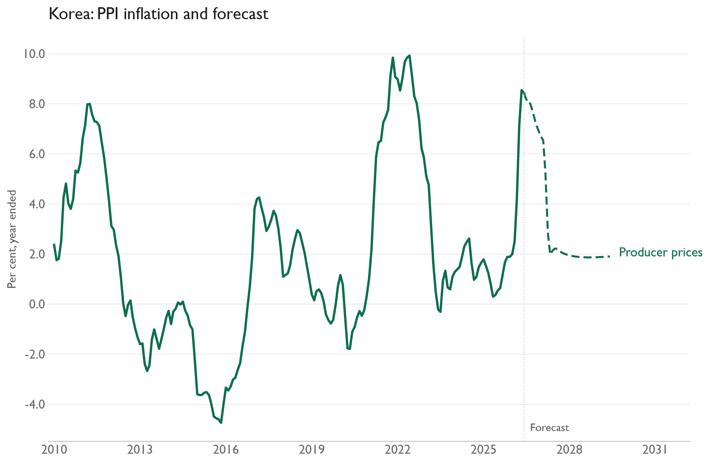

# Korea inflation forecasts

[Official core inflation histories](Korea%20-%20Core%20Inflation%20Measures.xlsx) include both standard cores through August 2026: excluding food and energy from 1990, and excluding agricultural products and oils from 1975. The shared construction pipeline and combined workbook are archived; this country workbook remains active. These core aggregates are complete for their published ranges; the separate detailed component-data workbook remains incomplete. Existing forecast outputs below have not been rerun.

Monthly VARs forecast headline CPI, core CPI excluding food and energy, and PPI for 36 months. Each includes inflation expectations, oil, import prices, and unemployment. The workbook contains only the required columns from the original `KR` sheet. Price indices enter as monthly percentage changes; expectations and unemployment enter as levels.

[Model code](kr.py) · [Input workbook](Data%20Inputs.xlsx) · [CPI CSV](results/kr_cpi_inflation_forecast.csv) · [PPI CSV](results/kr_ppi_inflation_forecast.csv)

[Results and methodology analysis](Analysis/README.md)

The last observed month in this data snapshot is June 2026; the saved forecasts run through June 2029. Run `py -3.14 run_all_var_models.py` from the `macro-work` folder to update results and charts from the bundled inputs. The [shared inflation guide](../../Documentation/INFLATION_MODELS.md) describes the method and dependencies.
