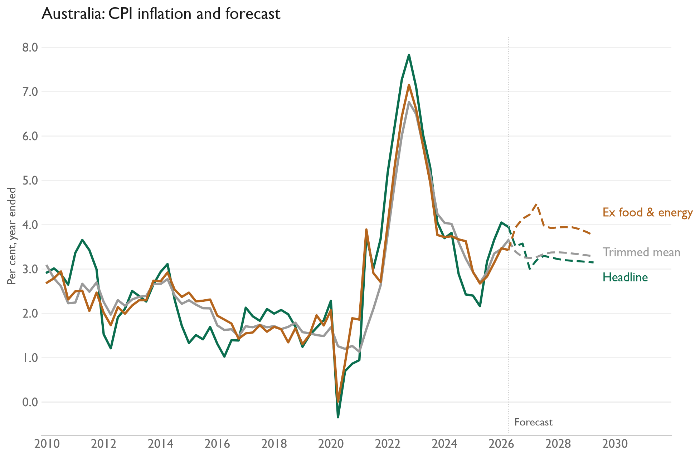

# Australia inflation forecast

A quarterly VAR forecasts headline CPI, trimmed mean CPI, and CPI excluding food and energy for 12 quarters. The drivers are unemployment, inflation expectations, import prices, oil, and Stage 2 pipeline prices. Oil and Stage 2 monthly values are averaged into quarters. The workbook contains only the required columns from the original `AU` and `AU-M` sheets.

[Model code](au.py) · [Input workbook](Data%20Inputs.xlsx) · [Forecast CSV](results/au_inflation_forecast.csv)

The last observed quarter in this data snapshot is 2026Q2; the saved forecast runs through 2029Q2. Run `py -3.14 run_all.py` in the parent `inflation-forecasts` folder to update results and charts from the bundled inputs. The [parent README](../README.md) describes the method and dependencies.
