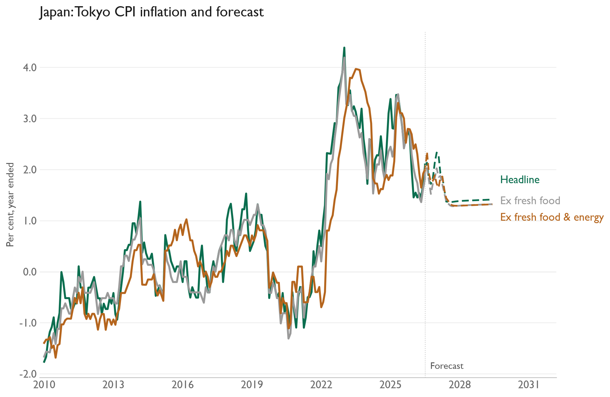

# Japan inflation forecasts

Monthly VARs forecast four national CPI measures and three Tokyo CPI measures for 36 months. Each includes unemployment, oil, import prices, and Stage 2 pipeline prices. The workbook contains only the required columns from the original `JN` sheet. All index variables enter as monthly percentage changes; unemployment enters as a level.

[Model code](jp.py) · [Input workbook](Data%20Inputs.xlsx) · [National CPI CSV](results/jp_cpi_inflation_forecast.csv) · [Tokyo CPI CSV](results/jp_tokyo_inflation_forecast.csv)

[Results and methodology analysis](Analysis/README.md)

The last observed month in this data snapshot is June 2026; the saved forecasts run through June 2029. Run `py -3.14 run_all.py` in the parent `inflation-forecasts` folder to update results and charts from the bundled inputs. The [parent README](../README.md) describes the method and dependencies.
