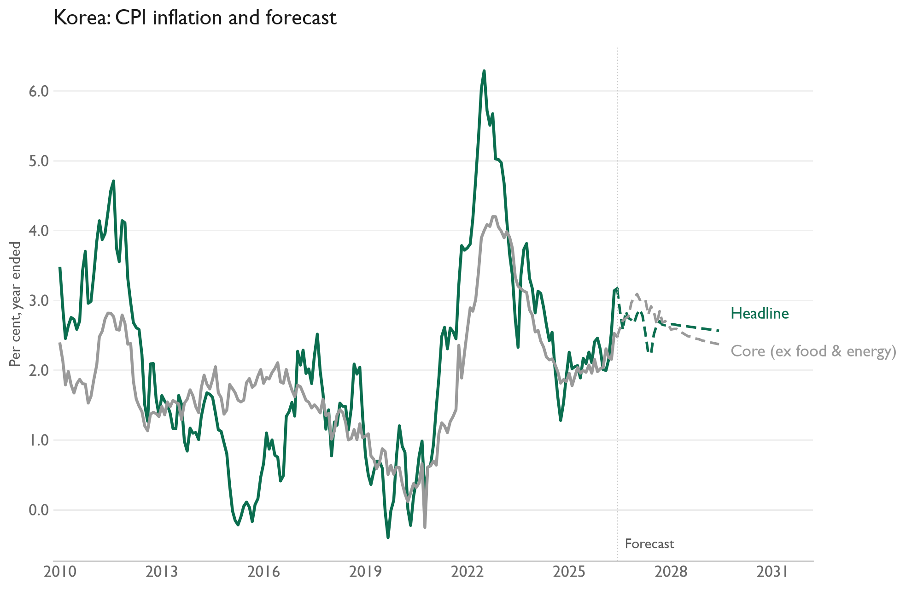

# Korea inflation forecasts

Monthly VARs forecast headline CPI, core CPI excluding food and energy, and PPI for 36 months. Each includes inflation expectations, oil, import prices, and unemployment. The workbook contains only the required columns from the original `KR` sheet. Price indices enter as monthly percentage changes; expectations and unemployment enter as levels.

[Model code](kr.py) · [Input workbook](Data%20Inputs.xlsx) · [CPI CSV](results/kr_cpi_inflation_forecast.csv) · [PPI CSV](results/kr_ppi_inflation_forecast.csv)

The last observed month in this data snapshot is June 2026; the saved forecasts run through June 2029. Run `py -3.14 run_all.py` in the parent `inflation-forecasts` folder to update results and charts from the bundled inputs. The [parent README](../README.md) describes the method and dependencies.
